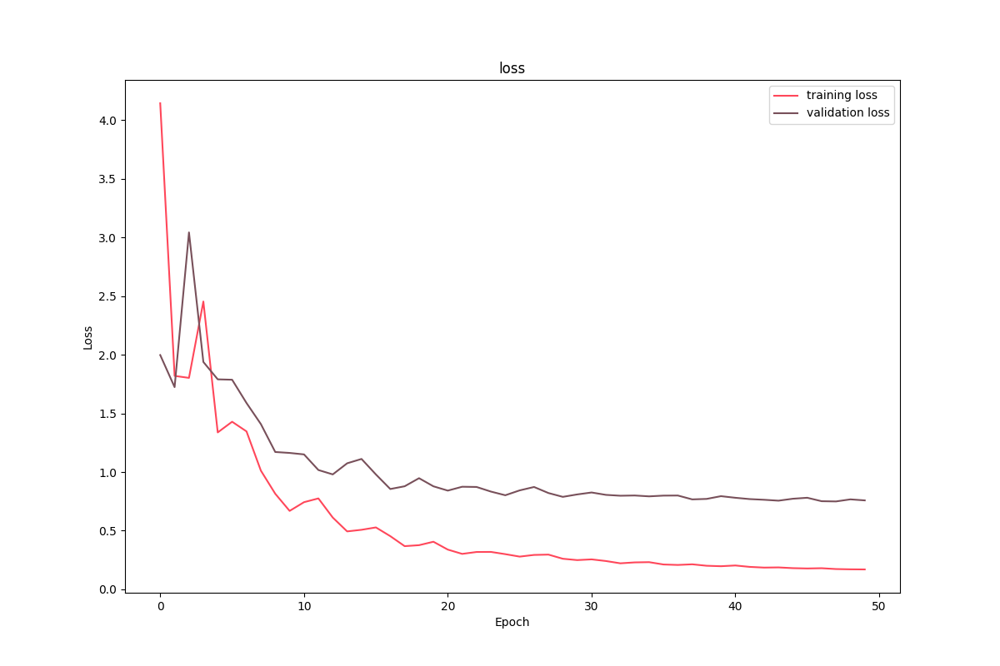
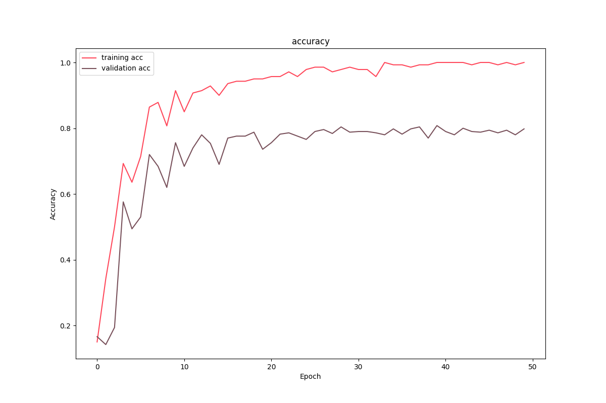
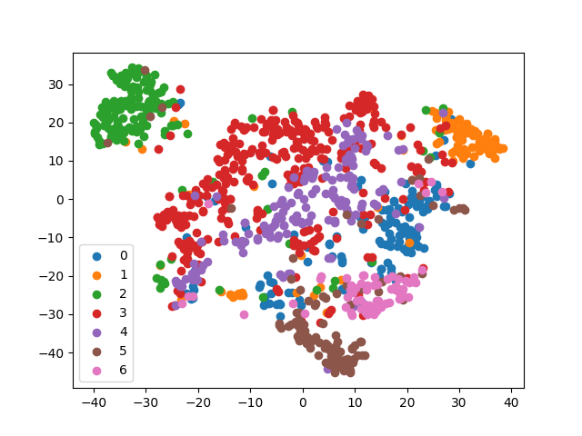

# GCN 结点分类

## 简介

本文通过 Pytorch 实现 GCN 对 Cora 数据集进行结点分类。

## 数据集说明

Cora 是一个引文关系数据集，由 2708 篇论文以及它们之间的引用关系构成边形成一个图（Graph）。这些论文按照主题被分为了 7 类，分别为神经网络、强化学习、规则学习、概率方法、遗传算法、理论研究和案例相关。每篇论文的特征通过词袋模型获得，维度为 1433，每一维代表一个词，$1$表示该词在该文章中出现，$0$表示未出现。

## 数据预处理

首先是下载 Cora 原始数据集，这里由于外网访问的原因，我已经将原始数据集和本文代码处理过的数据集上传到[BaiduNetDisk,code:zczc](https://pan.baidu.com/s/1PP6vJ0ivQBZJPl2CTVlsdA)，将该数据集下解压后放到 dataset 目录下即可。

获得原始数据集之后，对其进行处理，得到一个命名元组，该元组包含以下内容：

```
x: 所有节点的特征，shape为(2708, 1433)
y: 所有节点的label，shape为(2708, )
adjacency: 所有节点的邻接矩阵，shape为(2708, 2708)，这里采用稀疏矩阵存储
train_mask: 训练集掩码向量，shape为(2708, )属于训练集的位置值为True，否则False，共140个
val_mask: 训练集掩码向量，shape为(2708, )属于验证集的位置值为True，否则False，500
test_mask: 训练集掩码向量，shape为(2708, )属于测试集的位置值为True，否则False，共1000个
```

Cora 数据集由于比较小，这里没有采取分批读取的思路，而是读出来之后再分批取，这样因为没有了本地 IO 会大大提高效率。**这部分由于代码比较琐碎，就不列出了，可以通过文末Github访问仓库源码。**

## GCN 模型

根据GCN的定义$X' = \sigma(\widetilde{L}_{sym} X W)$来定义GCN层，然后堆叠三层GCN层构建图卷积网络，源码如下。

```python
class GraphConvolution(nn.Module):
    def __init__(self, input_dim, output_dim, use_bias=True):
        """
        L*X*\theta
        :param input_dim: 节点输入特征维度
        :param output_dim: 输出特征维度
        :param use_bias: 是否偏置
        """
        super(GraphConvolution, self).__init__()
        self.input_dim = input_dim
        self.output_dim = output_dim
        self.use_bias = use_bias
        self.weight = nn.Parameter(torch.Tensor(input_dim, output_dim))
        if self.use_bias:
            self.bias = nn.Parameter(torch.Tensor(output_dim))
        else:
            self.register_parameter('bias', None)
        self.reset_parameters()

    def reset_parameters(self):
        init.kaiming_uniform_(self.weight)
        if self.use_bias:
            init.zeros_(self.bias)

    def forward(self, adjacency, input_feature):
        support = torch.mm(input_feature, self.weight)
        output = torch.sparse.mm(adjacency, support)
        if self.use_bias:
            output += self.bias
        return output

    def __repr__(self):
        return self.__class__.__name__ + ' (' + str(self.input_dim) + ' -> ' + str(self.output_dim) + ')'


class GCN(nn.Module):

    def __init__(self, input_dim=1433):
        """
        两层GCN模型
        :param input_dim: 输入维度
        """
        super(GCN, self).__init__()
        self.gcn1 = GraphConvolution(input_dim, 256)
        self.gcn2 = GraphConvolution(256, 64)
        self.gcn3 = GraphConvolution(64, 7)

    def forward(self, adjacency, feature):
        h = F.relu(self.gcn1(adjacency, feature))
        logits = self.gcn2(adjacency, h)
        return logits
```

## 训练及其可视化

利用Cora数据集进行训练，训练代码如下，由于Cora很小，这里就直接全集进行训练。

```python
from collections import namedtuple

import torch
import torch.nn as nn
import torch.optim as optim
import numpy as np
from sklearn.manifold import TSNE
import matplotlib.pyplot as plt

from dataset import CoraData
from model import GCN

# hyper params
LEARNING_RATE = 0.1
WEIGHT_DACAY = 5e-4
EPOCHS = 50
DEVICE = "cuda:0" if torch.cuda.is_available() else "cpu"
Data = namedtuple('Data', ['x', 'y', 'adjacency', 'train_mask', 'val_mask', 'test_mask'])

# 加载数据，并转换为torch.Tensor
dataset = CoraData().data
node_feature = dataset.x / dataset.x.sum(1, keepdims=True)  # 归一化数据，使得每一行和为1
tensor_x = torch.from_numpy(node_feature).to(DEVICE)
tensor_y = torch.from_numpy(dataset.y).to(DEVICE)
tensor_train_mask = torch.from_numpy(dataset.train_mask).to(DEVICE)
tensor_val_mask = torch.from_numpy(dataset.val_mask).to(DEVICE)
tensor_test_mask = torch.from_numpy(dataset.test_mask).to(DEVICE)
normalize_adjacency = CoraData.normalization(dataset.adjacency)  # 规范化邻接矩阵

num_nodes, input_dim = node_feature.shape
indices = torch.from_numpy(np.asarray([normalize_adjacency.row, normalize_adjacency.col]).astype('int64')).long()
values = torch.from_numpy(normalize_adjacency.data.astype(np.float32))
tensor_adjacency = torch.sparse.FloatTensor(indices, values, (num_nodes, num_nodes)).to(DEVICE)

# 模型定义：Model, Loss, Optimizer
model = GCN(input_dim).to(DEVICE)
criterion = nn.CrossEntropyLoss().to(DEVICE)
optimizer = optim.Adam(model.parameters(), lr=LEARNING_RATE, weight_decay=WEIGHT_DACAY)


def train():
    model.train()
    train_loss_history = []
    train_acc_history = []
    val_acc_history = []
    val_loss_history = []
    train_y = tensor_y[tensor_train_mask]
    for epoch in range(EPOCHS):
        logits = model(tensor_adjacency, tensor_x)  # 前向传播
        train_mask_logits = logits[tensor_train_mask]  # 只选择训练节点进行监督
        loss = criterion(train_mask_logits, train_y)  # 计算损失值
        optimizer.zero_grad()
        loss.backward()
        optimizer.step()
        train_acc, _, _, train_loss = test(tensor_train_mask, tensor_y)
        val_acc, _, _, val_loss = test(tensor_val_mask, tensor_y)
        train_loss_history.append(loss.item())
        train_acc_history.append(train_acc)
        val_loss_history.append(val_loss)
        val_acc_history.append(val_acc.item())
        print("epoch {:03d}: training loss {:.4f}, training acc {:.4}, validation acc {:.4f}".format(epoch, loss.item(),
                                                                                                     train_acc.item(),
                                                                                                     val_acc.item()))
    return train_loss_history, train_acc_history, val_loss_history, val_acc_history


def test(mask, y):
    model.eval()
    with torch.no_grad():
        logits = model(tensor_adjacency, tensor_x)
        test_mask_logits = logits[mask]
        loss = criterion(test_mask_logits, y[mask])
        predict_y = test_mask_logits.max(1)[1]
        accuarcy = torch.eq(predict_y, tensor_y[mask]).float().mean()
    return accuarcy, test_mask_logits.cpu().numpy(), tensor_y[mask].cpu().numpy(), loss


def plot_loss_with_acc(train_loss_history, train_acc_history, val_loss_history, val_acc_history):
    plt.figure(figsize=(12, 8))
    plt.plot(range(len(train_loss_history)), train_loss_history, c=np.array([255, 71, 90]) / 255.,
             label='training loss')
    plt.plot(range(len(val_loss_history)), val_loss_history, c=np.array([120, 80, 90]) / 255.,
             label='validation loss')
    plt.xlabel('Epoch')
    plt.ylabel('Loss')
    plt.legend(loc=0)
    plt.title('loss')
    plt.savefig("../assets/loss.png")
    plt.show()

    plt.figure(figsize=(12, 8))
    plt.plot(range(len(train_acc_history)), train_acc_history, c=np.array([255, 71, 90]) / 255.,
             label='training acc')
    plt.plot(range(len(val_acc_history)), val_acc_history, c=np.array([120, 80, 90]) / 255.,
             label='validation acc')
    plt.xlabel('Epoch')
    plt.ylabel('Accuracy')
    plt.legend(loc=0)
    plt.title('accuracy')
    plt.savefig("../assets/acc.png")
    plt.show()


train_loss, train_acc, val_loss, val_acc = train()
test_acc, test_logits, test_label, _ = test(tensor_test_mask, tensor_y)
print("Test accuarcy: ", test_acc.item())
plot_loss_with_acc(train_loss, train_acc, val_loss, val_acc)

# tsne visualize
tsne = TSNE()
out = tsne.fit_transform(test_logits)
fig = plt.figure()
for i in range(7):
    indices = test_label == i
    x, y = out[indices].T
    plt.scatter(x, y, label=str(i))
plt.legend(loc=0)
plt.savefig('tsne.png')
plt.show()

```

训练过程的可视化如下面两张图，分别是训练集和验证集上的loss变化和训练集和验证集上的准确率变化。可以看到，训练集损失很快下降且准确率到达1，验证集也很快收敛准确率在0.8左右，这也说明，三层GCN的建模能力虽然不错但也很有限。




同时，通过TSNE将输出层的score嵌入进行二维可视化，可以发现，区分度还是很高的，这表示GCN学到的特征其实是很有效的。



## 补充说明

本文数据处理部分思路参考自PyG框架以及《深入浅出图神经网络》的内容，对图网络理论感兴趣的可以阅读这本书。本文涉及到的代码开源于 Github，欢迎 star 和 fork。
